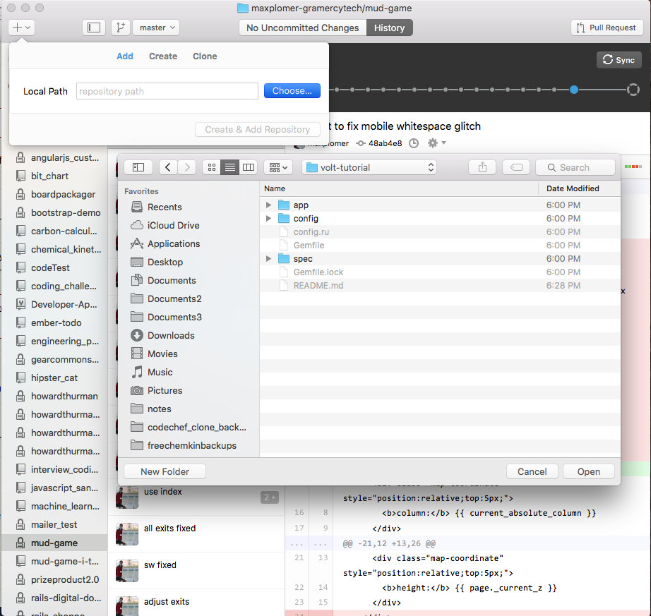

# volt-tutorial

## About

This is a tutorial for the Volt Ruby web-framework, http://www.voltframework.com 

Covering:
 - general use, github, dev environment
 - deployment on aws/heroku, discussion of safari glitch with heroku-volt deployment
 - adding Ratchet mobile css framework to volt
 - Using cloud mongo (compose.io) or local mongo database

## Dev Environment (your laptop):

Note: $ at start indicates a system command on either dev machine or server

Install rvm (Ruby version manager)

    $ \curl -sSL https://get.rvm.io | bash -s stable

Install ruby 2.2.2 using rvm

    $ rvm install 2.2.2
    $ rvm use 2.2.2 --default
    $ ruby -v

Create a new app:

    $ volt new volt-tutorial

To run your app: 

    $ cd volt-tutorial
    $ bundle exec volt server

Create a new git repo:

    $ git init

Add new files and any changes to known files (later done automatically by github desktop app, can use checkboxes to disable tracking on file, or add to .gitignore manually)

    $ git add -A

Commit changes using command line (later done with commit button in github desktop app)

    $ git commit -m "Initial code repository"

Push changes using terminal to github after linked (can just press sync on desktop app)

    $ git push

Push changes to heroku

    $ git push heroku master

Open sublime text editor(other editors: atom, textmate) 

    $ subl .

[explain how to set subl to bash profile etc]

### How to link to github with desktop app

Sign in to your github account from the "Github Desktop" menu, then click "Preferences"

Click the plus sign to add a new repo, then navigate to the folder that you create the git repository, then click "open" and then "Create & Add Repository".  At this point the Github desktop app can track and add changes to your repo, and can be publish to Github (button later becomes sync button) by pressing the "Publish" button in upper right, and then "Publish Repository"

# AWS deployment

[how to generate pem file and new server]

ssh to aws server

    $ ssh -i mud-game-key-pair.pem ubuntu@ec2-54-209-61-233.compute-1.amazonaws.com

Install new ruby on ubuntu, first install dependcies for rvm

    $ sudo apt-get install libgdbm-dev libncurses5-dev automake libtool bison libffi-dev
    $ curl -L https://get.rvm.io | bash -s stable
    $ source ~/.rvm/scripts/rvm
    $ rvm install 2.2.2
    $ rvm use 2.2.2 --default
    $ ruby -v

Install newest bundler 

    $ gem install bundler --pre


Install dependency for nokogiri

    $ sudo apt-get install ruby-dev zlib1g-dev

Copy app to local volt-tutorial-aws without .git, then copy to aws server with scp command

    $ scp -i my-key-pair.pem -r volt-tutorial-aws ubuntu@ec2-12-345-67-890.compute-1.amazonaws.com:/home/ubuntu

ssh back to server, run volt server with desired port no hangouts

    $ cd volt-tutorial-aws
    $ nohup bundle exec volt server -p 1234 &

